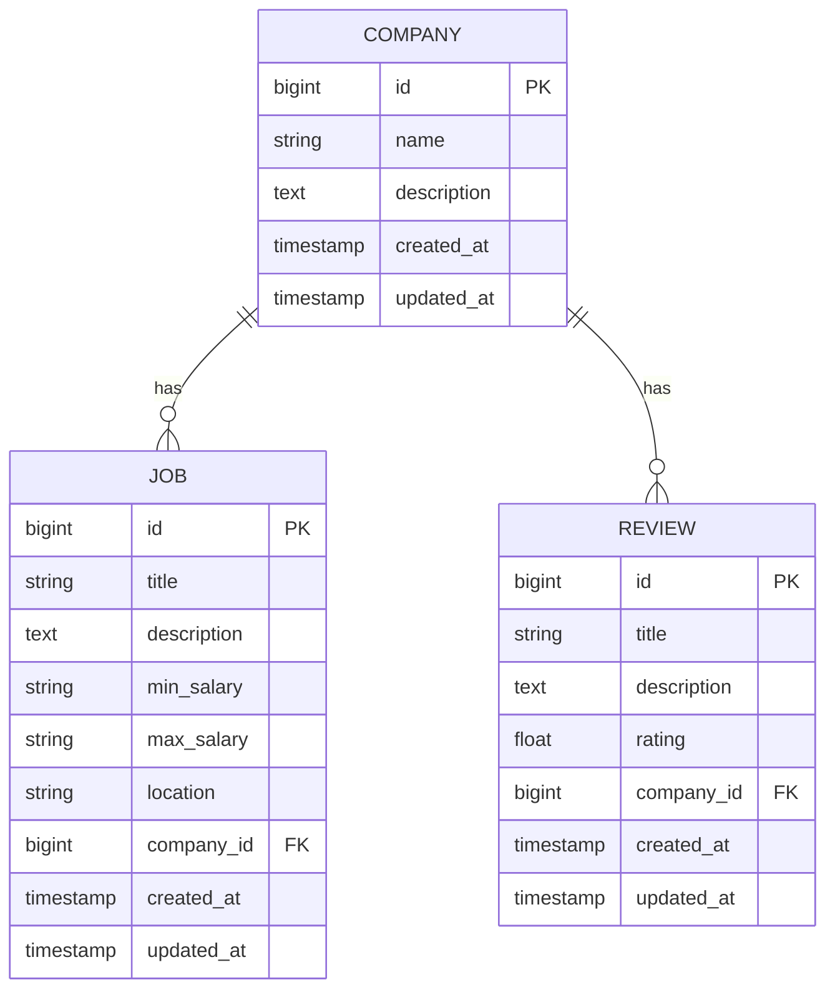

# Job Application Portal

A full-stack job application management system built with Spring Boot and PostgreSQL, featuring company management, job listings, and reviews.

## 🚀 Features

- **Company Management**
  - CRUD operations for companies
  - View company details and associated jobs

- **Job Listings**
  - Create and manage job postings
  - Search and filter jobs
  - Associate jobs with companies

- **Reviews**
  - Add and view company reviews
  - Rating system for companies

## 🛠️ Tech Stack

- **Backend**: Spring Boot 3.x
- **Database**: PostgreSQL
- **Build Tool**: Maven
- **Containerization**: Docker
- **API Documentation**: Spring REST Docs
- **Testing**: JUnit, Mockito

## 📦 Prerequisites

- Java 17 or higher
- Maven 3.8+
- Docker and Docker Compose
- PostgreSQL 15+

## 🚀 Getting Started

### Local Development

1. **Clone the repository**
   ```bash
   git clone https://github.com/your-username/job-application-portal.git
   cd job-application-portal
   ```

2. **Set up the database**
   - Start PostgreSQL using Docker Compose:
     ```bash
     docker-compose up -d postgres
     ```

3. **Build and run the application**
   ```bash
   mvn clean install
   mvn spring-boot:run
   ```

### Using Docker

```bash
# Build and start all services
docker-compose up -d --build

# View logs
docker-compose logs -f app
```

## 🌐 API Endpoints

### Company Endpoints
- `GET /companies` - Get all companies
- `GET /companies/{id}` - Get company by ID
- `POST /companies` - Create a new company
- `PUT /companies/{id}` - Update a company
- `DELETE /companies/{id}` - Delete a company

### Job Endpoints
- `GET /jobs` - Get all jobs
- `GET /jobs/{id}` - Get job by ID
- `POST /jobs` - Create a new job
- `PUT /jobs/{id}` - Update a job
- `DELETE /jobs/{id}` - Delete a job

### Review Endpoints
- `GET /companies/{companyId}/reviews` - Get all reviews for a company
- `POST /companies/{companyId}/reviews` - Add a review to a company
- `GET /companies/{companyId}/reviews/{reviewId}` - Get a specific review
- `PUT /companies/{companyId}/reviews/{reviewId}` - Update a review
- `DELETE /companies/{companyId}/reviews/{reviewId}` - Delete a review

## 🗄️ Database Schema



## 🧪 Testing

Run tests using:
```bash
mvn test
```

## 🔧 Configuration

Application properties can be configured in `src/main/resources/application.properties`:

```properties
# Database Configuration
spring.datasource.url=jdbc:postgresql://localhost:5432/jobapp
spring.datasource.username=postgres
spring.datasource.password=root

# JPA/Hibernate
spring.jpa.hibernate.ddl-auto=update
spring.jpa.show-sql=true
```

## 📝 License

This project is licensed under the MIT License - see the [LICENSE](LICENSE) file for details.

## 🤝 Contributing

1. Fork the project
2. Create your feature branch (`git checkout -b feature/AmazingFeature`)
3. Commit your changes (`git commit -m 'Add some AmazingFeature'`)
4. Push to the branch (`git push origin feature/AmazingFeature`)
5. Open a Pull Request

## 📫 Contact

Your Name - your.email@example.com

Project Link: [https://github.com/your-username/job-application-portal](https://github.com/your-username/job-application-portal)
